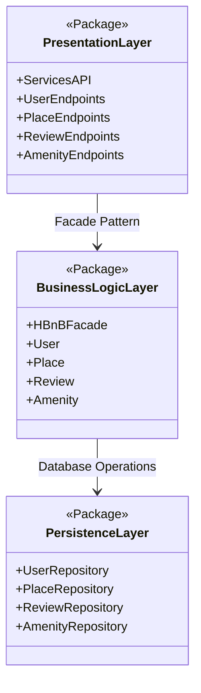
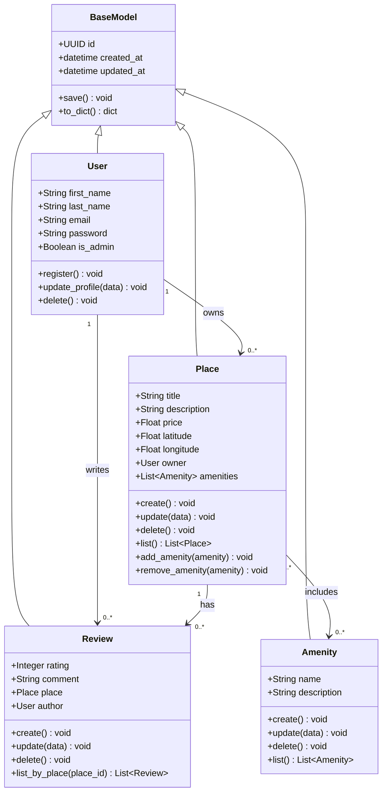
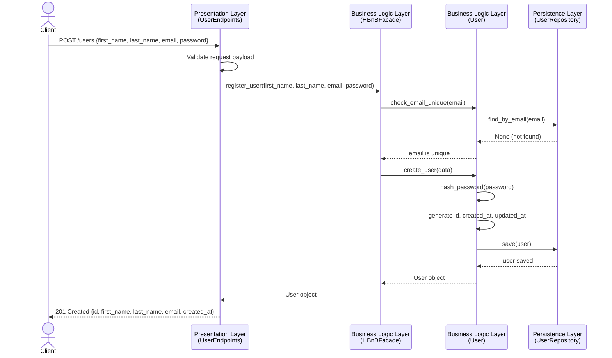
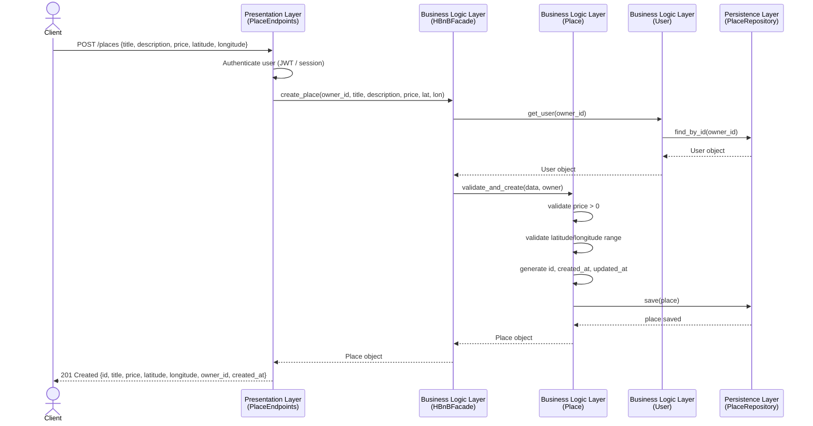
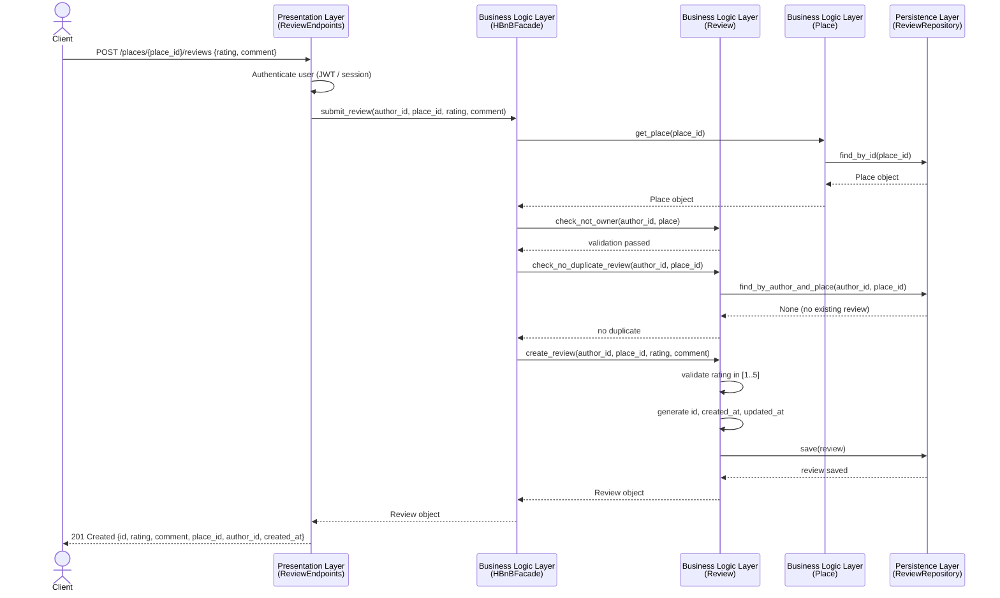
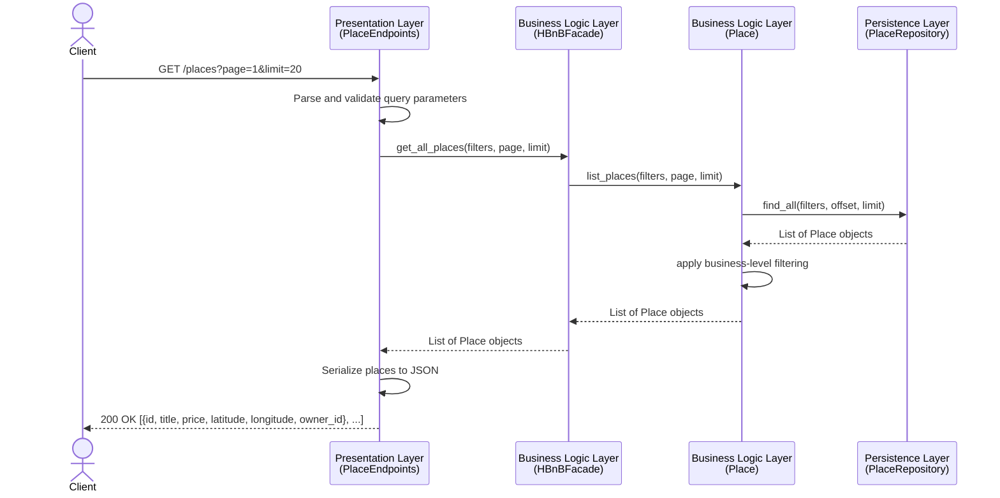

# HBnB Evolution – Technical Architecture Document

## Table of Contents

1. [Introduction](#introduction)
2. [Task 0 – High-Level Package Diagram](#task-0--high-level-package-diagram)
3. [Task 1 – Detailed Class Diagram (Business Logic Layer)](#task-1--detailed-class-diagram-business-logic-layer)
4. [Task 2 – Sequence Diagrams for API Calls](#task-2--sequence-diagrams-for-api-calls)
5. [Task 3 – Compilation and Summary](#task-3--compilation-and-summary)

---

## Introduction

This document provides the complete technical architecture documentation for **HBnB Evolution**, a simplified AirBnB-like application. It covers the three-layer architecture, the core business entities, and the flow of data for key API operations.

The application supports:
- **User Management** – registration, profile updates, admin flag.
- **Place Management** – listing properties with details and amenities.
- **Review Management** – users leaving ratings and comments on places.
- **Amenity Management** – managing features that can be attached to places.

All entities share common audit fields (`id`, `created_at`, `updated_at`) and the architecture is organized into three layers communicating via the **Facade Pattern**.

---

## Task 0 – High-Level Package Diagram

### Overview

The HBnB application follows a layered architecture with three distinct layers:

1. **Presentation Layer** – Services and API endpoints.
2. **Business Logic Layer** – Core models and the Facade.
3. **Persistence Layer** – Database access repositories.

Communication between the Presentation Layer and the Business Logic Layer is mediated by the **Facade Pattern**, which provides a single, unified interface and decouples the two layers.

### Diagram



### Layer Descriptions

#### Presentation Layer (Services, API)

Handles all user-facing interactions. Exposes the application's functionality through RESTful API endpoints.

| Component | Responsibility |
|---|---|
| ServicesAPI | Main entry point; routes incoming HTTP requests |
| UserEndpoints | User registration, login, profile management |
| PlaceEndpoints | Create, retrieve, update, delete places |
| ReviewEndpoints | Submit and manage reviews |
| AmenityEndpoints | Manage amenities associated with places |

#### Business Logic Layer (Models)

Contains the core logic and entity models. The **HBnBFacade** is the single point of contact exposed to the Presentation Layer.

| Component | Responsibility |
|---|---|
| HBnBFacade | Unified interface for all Presentation Layer calls |
| User | Business rules for user entities |
| Place | Business rules for place entities |
| Review | Business rules for review entities |
| Amenity | Business rules for amenity entities |

#### Persistence Layer

Manages data storage and retrieval, abstracting the underlying database technology.

| Component | Responsibility |
|---|---|
| UserRepository | CRUD operations for User records |
| PlaceRepository | CRUD operations for Place records |
| ReviewRepository | CRUD operations for Review records |
| AmenityRepository | CRUD operations for Amenity records |

### Facade Pattern Explanation

All requests from API endpoints flow through `HBnBFacade` before reaching any model. This provides:

- **Simplified Interface** – API code only knows about the Facade.
- **Loose Coupling** – Model internals can change without touching API code.
- **Centralized Control** – Validation, auth checks, and error handling in one place.
- **Maintainability** – Internals can be swapped or refactored independently.

```
Client Request
      │
      ▼
Presentation Layer (API Endpoints)
      │  via Facade Pattern
      ▼
Business Logic Layer (HBnBFacade → Models)
      │  via Database Operations
      ▼
Persistence Layer (Repositories)
      │
      ▼
Database
```

---

## Task 1 – Detailed Class Diagram (Business Logic Layer)

### Overview

This class diagram details the four core entities of the Business Logic Layer: **User**, **Place**, **Review**, and **Amenity**. All entities inherit from a common **BaseModel** that provides unique identification and audit timestamps.

### Diagram



### Entity Descriptions

#### BaseModel

All entities inherit from `BaseModel`, which provides:

| Attribute / Method | Type | Description |
|---|---|---|
| `id` | UUID | Unique identifier generated at creation |
| `created_at` | datetime | Timestamp when the object was created |
| `updated_at` | datetime | Timestamp of the last update |
| `save()` | method | Persists changes and refreshes `updated_at` |
| `to_dict()` | method | Serializes the object to a dictionary |

#### User

Represents a registered user of the platform.

| Attribute / Method | Type | Description |
|---|---|---|
| `first_name` | String | User's first name |
| `last_name` | String | User's last name |
| `email` | String | Unique email address; used for login |
| `password` | String | Hashed password |
| `is_admin` | Boolean | `True` if the user has administrator privileges |
| `register()` | method | Creates a new user account |
| `update_profile(data)` | method | Updates name, email, or password |
| `delete()` | method | Soft- or hard-deletes the user |

#### Place

Represents a property listed by a user.

| Attribute / Method | Type | Description |
|---|---|---|
| `title` | String | Name of the place |
| `description` | String | Detailed description |
| `price` | Float | Nightly price |
| `latitude` | Float | Geographic latitude |
| `longitude` | Float | Geographic longitude |
| `owner` | User | The user who listed the place |
| `amenities` | List[Amenity] | Amenities available at the place |
| `create()` | method | Saves a new place |
| `update(data)` | method | Updates place attributes |
| `delete()` | method | Removes the place |
| `list()` | method | Returns all places |
| `add_amenity(amenity)` | method | Associates an amenity with the place |
| `remove_amenity(amenity)` | method | Removes an amenity association |

#### Review

Represents feedback left by a user for a place.

| Attribute / Method | Type | Description |
|---|---|---|
| `rating` | Integer | Numeric rating (1–5) |
| `comment` | String | Text of the review |
| `place` | Place | The place being reviewed |
| `author` | User | The user who wrote the review |
| `create()` | method | Saves a new review |
| `update(data)` | method | Updates rating or comment |
| `delete()` | method | Removes the review |
| `list_by_place(place_id)` | method | Returns all reviews for a place |

#### Amenity

Represents a feature or facility available at a place.

| Attribute / Method | Type | Description |
|---|---|---|
| `name` | String | Name of the amenity (e.g., "Wi-Fi") |
| `description` | String | Details about the amenity |
| `create()` | method | Saves a new amenity |
| `update(data)` | method | Updates name or description |
| `delete()` | method | Removes the amenity |
| `list()` | method | Returns all amenities |

### Relationships

| Relationship | Type | Description |
|---|---|---|
| User → Place | One-to-Many | A user can own zero or more places |
| User → Review | One-to-Many | A user can write zero or more reviews |
| Place → Review | One-to-Many | A place can have zero or more reviews |
| Place ↔ Amenity | Many-to-Many | A place can have multiple amenities; an amenity can belong to multiple places |

---

## Task 2 – Sequence Diagrams for API Calls

Each diagram shows the interaction between four actors: the **Client**, the **Presentation Layer** (API), the **Business Logic Layer** (Facade + Models), and the **Persistence Layer** (Repository).

---

### 2.1 User Registration

A new user submits their details to create an account.



**Notes:**
- The password is hashed before storage; the plain-text password is never persisted.
- If the email already exists, the Facade raises a validation error and the API returns `409 Conflict`.
- The `is_admin` flag defaults to `False` for self-registered users.

---

### 2.2 Place Creation

An authenticated user lists a new property.



**Notes:**
- The owner is resolved from the authenticated user's ID.
- Business rules enforced: `price` must be positive; `latitude` must be between -90 and 90; `longitude` between -180 and 180.
- Returns `401 Unauthorized` if the client is not authenticated.

---

### 2.3 Review Submission

An authenticated user submits a review for a place they visited.



**Notes:**
- A user cannot review their own place; the Facade returns `400 Bad Request` if attempted.
- A user may only submit one review per place; a duplicate attempt returns `409 Conflict`.
- `rating` must be an integer between 1 and 5 inclusive.

---

### 2.4 Fetching a List of Places

A client (authenticated or anonymous) retrieves all available places.



**Notes:**
- The endpoint supports optional query filters (e.g., price range, location).
- Pagination is handled via `page` and `limit` parameters.
- Returns an empty list `[]` with `200 OK` if no places match the criteria.

---

## Task 3 – Compilation and Summary

### Architecture at a Glance

The HBnB Evolution application is structured around three layers that each have a well-defined, single responsibility:

| Layer | Primary Role | Key Artifact |
|---|---|---|
| Presentation Layer | Expose HTTP API, validate input, format output | API Endpoints (Flask/REST) |
| Business Logic Layer | Enforce business rules, coordinate entities | HBnBFacade + Model classes |
| Persistence Layer | Store and retrieve data | Repository classes |

### Design Decisions

**Why the Facade Pattern?**
The `HBnBFacade` is the only class the Presentation Layer ever calls. This means:
- API endpoints are thin and contain no business logic.
- Business rules (e.g., "a user cannot review their own place") live in exactly one place.
- Swapping out or testing the Business Logic Layer does not require changes to any API code.

**Why a BaseModel?**
Centralizing `id`, `created_at`, and `updated_at` in `BaseModel` ensures:
- Every entity is uniquely identifiable with a UUID.
- Audit trails are automatic and consistent across all entity types.

**Why Many-to-Many for Place ↔ Amenity?**
An amenity such as "Wi-Fi" is likely shared across many places, and a place typically has multiple amenities. A join table (or equivalent ORM relationship) avoids duplication and makes amenity management independent of any specific place.

### Entity Relationship Overview

```
User ──< Place       (one user owns many places)
User ──< Review      (one user writes many reviews)
Place ──< Review     (one place has many reviews)
Place >──< Amenity   (many-to-many via association table)
```

### API Surface Summary

| Method | Endpoint | Description |
|---|---|---|
| POST | `/users` | Register a new user |
| GET | `/users/{id}` | Retrieve a user profile |
| PUT | `/users/{id}` | Update a user profile |
| DELETE | `/users/{id}` | Delete a user |
| POST | `/places` | Create a new place |
| GET | `/places` | List all places |
| GET | `/places/{id}` | Retrieve a place |
| PUT | `/places/{id}` | Update a place |
| DELETE | `/places/{id}` | Delete a place |
| POST | `/places/{id}/reviews` | Submit a review for a place |
| GET | `/places/{id}/reviews` | List reviews for a place |
| PUT | `/reviews/{id}` | Update a review |
| DELETE | `/reviews/{id}` | Delete a review |
| POST | `/amenities` | Create a new amenity |
| GET | `/amenities` | List all amenities |
| PUT | `/amenities/{id}` | Update an amenity |
| DELETE | `/amenities/{id}` | Delete an amenity |
