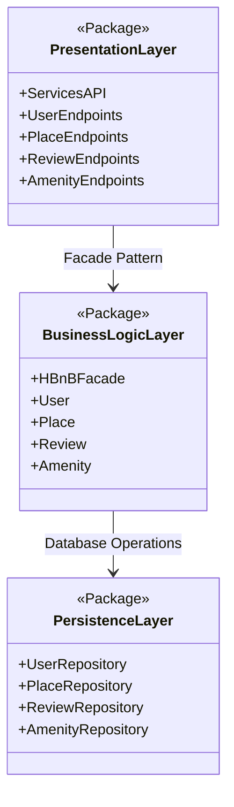

# HBnB Application Architecture Documentation

## 0. High-Level Package Diagram

### Overview

This document presents the high-level package diagram for the HBnB application, illustrating its three-layer architecture and the communication between these layers via the **Facade Pattern**.

---

### Package Diagram



---

### Layer Descriptions

#### 1. Presentation Layer (Services, API)

The **Presentation Layer** is responsible for handling all interactions between the end user and the application. It exposes the application's functionality through a set of services and RESTful API endpoints.

**Components:**
- **ServicesAPI** – The main entry point that routes incoming HTTP requests.
- **UserEndpoints** – API routes for user registration, login, profile management.
- **PlaceEndpoints** – API routes for creating, retrieving, updating, and deleting places.
- **ReviewEndpoints** – API routes for submitting and managing reviews.
- **AmenityEndpoints** – API routes for managing amenities associated with places.

**Responsibilities:**
- Receive and validate incoming requests from clients.
- Delegate business logic operations to the Business Logic Layer via the Facade.
- Format and return responses to clients.

---

#### 2. Business Logic Layer (Models)

The **Business Logic Layer** contains the core logic of the application and the models representing the system's main entities. This layer also houses the **Facade**, which acts as the single point of contact between the Presentation Layer and the rest of the system.

**Components:**
- **HBnBFacade** – Implements the Facade Pattern, providing a unified interface to the Presentation Layer. All calls from the API pass through this facade.
- **User** – Model representing a registered user of the platform.
- **Place** – Model representing a property or location listed on the platform.
- **Review** – Model representing a review written by a user for a place.
- **Amenity** – Model representing a feature or amenity available at a place.

**Responsibilities:**
- Enforce business rules and validations.
- Coordinate operations across multiple models.
- Interact with the Persistence Layer to read and write data.

---

#### 3. Persistence Layer

The **Persistence Layer** manages data storage and retrieval. It abstracts all database interactions behind repository objects, decoupling the Business Logic Layer from the underlying data store.

**Components:**
- **UserRepository** – Handles CRUD operations for User entities.
- **PlaceRepository** – Handles CRUD operations for Place entities.
- **ReviewRepository** – Handles CRUD operations for Review entities.
- **AmenityRepository** – Handles CRUD operations for Amenity entities.

**Responsibilities:**
- Persist entity data to the database.
- Retrieve entity data from the database.
- Abstract the specific database technology from the rest of the application.

---

### Facade Pattern Explanation

The **Facade Pattern** is used to simplify the interaction between the Presentation Layer and the Business Logic Layer. Rather than having API endpoints directly call multiple models or services, all requests are routed through the `HBnBFacade`. This provides several benefits:

1. **Simplified Interface** – The Presentation Layer only needs to know about the Facade, not the internal complexity of the Business Logic Layer.
2. **Loose Coupling** – Changes to business logic models do not require changes to API endpoint code, as long as the Facade interface remains consistent.
3. **Centralized Logic** – Cross-cutting concerns such as input validation, authorization checks, and error handling can be managed centrally within the Facade.
4. **Maintainability** – The Facade makes it easier to swap out or refactor the Business Logic Layer without affecting the Presentation Layer.

**Communication Flow:**

```
Client Request
      │
      ▼
Presentation Layer (API Endpoints)
      │  calls via
      ▼
Business Logic Layer (HBnBFacade)
      │  delegates to models and
      ▼
Business Logic Layer (Models: User, Place, Review, Amenity)
      │  reads/writes via
      ▼
Persistence Layer (Repositories)
      │
      ▼
Database
```

---

### Summary

| Layer              | Responsibility                          | Key Components                              |
|--------------------|----------------------------------------|---------------------------------------------|
| Presentation Layer | User interaction, API exposure          | ServicesAPI, UserEndpoints, PlaceEndpoints, ReviewEndpoints, AmenityEndpoints |
| Business Logic     | Core logic, entity models, Facade       | HBnBFacade, User, Place, Review, Amenity    |
| Persistence Layer  | Data storage and retrieval              | UserRepository, PlaceRepository, ReviewRepository, AmenityRepository |
